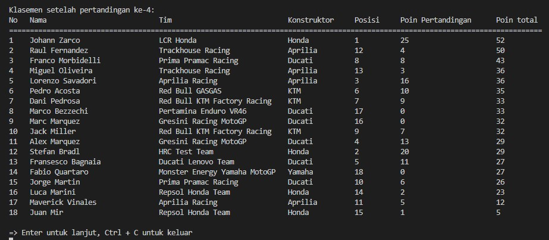

# Laporan Kuis 2 Algoritma dan Struktur Data

    

Innama Maesa Putri  
TI 1B  
15  
2341720235

## Klasemen MotoGP menggunakan Linked List
Penghitungan poin : 
<li>1st place: 25 points
<li>2nd place: 20 points
<li>3rd place: 16 points
<li>4th place: 13 points
<li>5th place: 11 points
<li>6th place: 10 points
<li>7th place: 9 points
<li>8th place: 8 points
<li>9th place: 7 points
<li>10th place: 6 points
<li>11th place: 5 points
<li>12th place: 4 points
<li>13th place: 3 points
<li>14th place: 2 points
<li>15th place: 1 point
<li>Posisi setelah 15 tidak mendapatkan poin.

Hasil Program : 

Proses perhitungan akan terus berlanjut hingga pada pertandingan ke 20 dikarenakan dalam satu musim motoGp rata-rata pertandingannadalah 20 pertandingan. Dan berikut adalah hasil dari pertandingan ke 20 atau di klasemen akhir :

