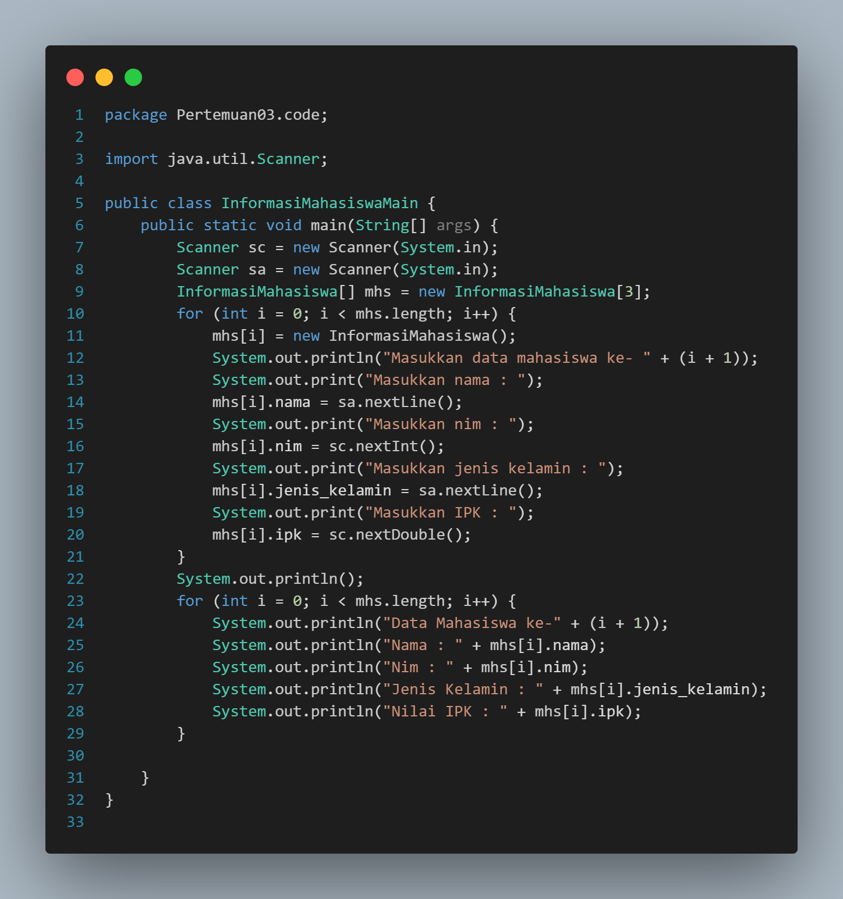

# Laporan Jobsheet III Algoritma dan Struktur Data

    

Nama : Innama Maesa Putri

NIM : 2341720235

<b>Percobaan 1 : Membuat Array dari Object, Mengisi dan Menampilkan</b>

Kode Program Persegi panjang : 

Kode Program Main : 

Hasil Program : 

Pertanyaan

1. Berdasarkan uji coba 3.2, apakah class yang akan dibuat array of object harus selalu memiliki atribut dan sekaligus method?Jelaskan!

Jawab : Tidak, jika suatu class akan dibuat array of object namun tidak memiliki atribut dan sekaligus method ia hanya akan bisa meng-instansiasi array of objects dan atribut objek di dalam class tersebut.

2. Apakah class PersegiPanjang memiliki konstruktor?Jika tidak, kenapa dilakukan pemanggilan konstruktur pada baris program berikut

Jawab : Dalam kasus ini, konstruktor tidak didefinisikan di dalam class. Namun setiap instansiaso objek selalu dibutuhkan konstruktor dari kelas yang diwujudkan ke dalam objek

3. Apa yang dimaksud dengan kode berikut ini

Jawab : Instansiasi array of object dengan nama ppArray dari class persegi panjang yang akan berisi 3 elemen

4. Apa yang dimaksud dengan kode berikut ini

Jawab : Instansiasi objek pada indeks ke-0 atau pada elemen pertama dari array of objects ppArray dengan atribut objek berupa panjang dan lebar yang bernilai 80 dan 40 

5. Mengapa class main dan juga class PersegiPanjang dipisahkan pada uji coba 3.2

Jawab : Karena class PersegiPanjang merupakan konsep persegi panjang yang perlu diwujudkan dalam sebuah objek. Perwujudan tersebut dilakukan di class main dengan proses instansiasi

<b>Percobaan 2 : Menerima Input Isian Array Menggunakan Looping</b>

Kode Program : 

Hasil Program : 

Pertanyaan

1. Apakah array of object dapat diimplementasikan pada array 2 Dimensi?

Jawab : Iya, array of object dapat diimplementasikan pada array 2 Dimensi

2. Jika jawaban soal no satu iya, berikan contohnya! Jika tidak, jelaskan!

Jawab : Contohnya bisa ditemukan pada kasus penyimpanan barang toko swalayan yang tiap barisnya dipisahkan sesuai kategori barang

3. Jika diketahui terdapat class Persegi yang memiliki atribut sisi bertipe integer, maka kode dibawah ini akan memunculkan error saat dijalankan. Mengapa?

Jawab : Error dikarenakan belum dilakukan instansiasi secara terpisah pada objek pgArray[5] hanya ada instansiasi array pgArray

4. Modifikasi kode program pada praktikum 3.3 agar length array menjadi inputan dengan Scanner!

5. Apakah boleh Jika terjadi duplikasi instansiasi array of objek, misalkan saja instansiasi dilakukan pada ppArray[i] sekaligus ppArray[0]?Jelaskan !

Jawab : Boleh, tidak terjadi error <b>namun</b> nilai panjang lebar pada objek dengan indeks 0 nilainya akan digantikan dengan instansiasi dengan pengisian nilai atribut saat looping

<b>Percobaan 3 : Penambahan Operasi Matematika di Dalam Method</b>

Kode Program Balok : 

Kode Program Main : 

Hasil Program : 

Pertanyaan

1. Dapatkah konstruktor berjumlah lebih dalam satu kelas? Jelaskan dengan contoh!

Jawab : Konstruktor bisa berjumlah dua dalam satu kelas. Konstruktor sendiri merupakan method yang memiliki nama sama dengan nama class. Konstruktor pertama merupakan konstruktor default tanpa parameter. Konstruktor kedua merupakan konstruktor dengan parameter

2. Tambahkan konstruktor pada class Segitiga tersebut yang berisi parameter int a, int t yang masing-masing digunakan untuk mengisikan atribut alas dan tinggi.

3. Tambahkan method hitungLuas() dan hitungKeliling() pada class Segitiga
tersebut. Asumsi segitiga adalah segitiga siku-siku. (Hint: Anda dapat menggunakan bantuan library Math pada Java untuk mengkalkulasi sisi miring)

4. Pada fungsi main, buat array Segitiga sgArray yang berisi 4 elemen, isikan masing-masing atributnya sebagai berikut

5. Kemudian menggunakan looping, cetak luas dan keliling dengan cara memanggil method hitungLuas() dan hitungKeliling()

<b>Latihan Praktikum</b>

1. Menghitung Luas Permukaan dan Volume Bangun ruang

Kode class kerucut : 

Kode class limas : 

Kode class bola : 

Kode class main (sebelum modifikasi) : 

Kode class main (setelah modifikasi) : 

Hasil program (setelah modifikasi) : 

2. Mendata Informasi Mahasiswa

Kode program : 

Hasil Program : 

