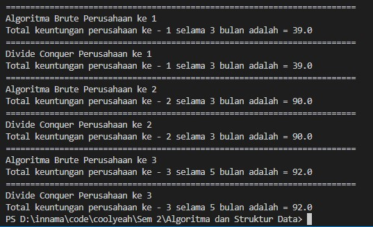
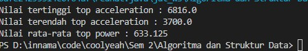

# Laporan Jobsheet IV Algoritma dan Struktur Data

    

Nama : Innama Maesa Putri

NIM : 2341720235

<b>Percobaan 1 : Menghitung Nilai Faktorial dengan Algoritma Brute Force dan Divide and Conquer</b>

Kode Program : 

Kode Program Main : 

Hasil Program : 

Pertanyaan

1. Pada base line Algoritma Divide Conquer untuk melakukan pencarian nilai faktorial, jelaskan perbedaan bagian kode pada penggunaan if dan else!

Jawab : Pada algoritma Divide Conquer terdapat fungsi rekursif yang mengembalikan dirinya sendiri. Pada bagian if merupakan base case dari fungsi rekursif jika parameter bernilai 1. Pada bagian else dilakukan rekursif yang memanggil dirinya sendiri dengan parameter awal dikurangi 1

2. Apakah memungkinkan perulangan pada method faktorialBF() dirubah selain menggunakan for?Buktikan!

Jawab : Perulangan dapat digantikan dengan menggunakan perulangan while

3. Jelaskan perbedaan antara fakto *= i; dan int fakto = n * faktorialDC(n-1); !

Jawab : Pada fakto *= i dilakukan operasi assignment dalam iterasi namun pada fakto = n * faktorialDC(n-1) dilakukan proses rekursif

<b>Percobaan 2 : Menghitung Hasil Pangkat dengan Algoritma Brute Force dan Divide and Conquer</b>

Kode Program : 

Kode Program Main : 

Hasil Program : 

Pertanyaan

1. Jelaskan mengenai perbedaan 2 method yang dibuat yaitu PangkatBF() dan PangkatDC()!

Jawab : Pada method PangkatBF terjadi penghitungan pangkat yang menggunakan algoritma Brute Force dengan menerapkan perhitungan per indeks pada perulangan. Sedangkan pada method PangkatDC menggunakan algoritma Devide Conquer yang membagi tiap bagian pangkat kemudian di hitung per bagian dan pada akhirnya di combine

2. Apakah tahap combine sudah termasuk dalam kode tersebut?Tunjukkan!

Jawab : Terdapat dalam method PangkatDC di bagian rekursif berikut : 

if (n % 2 == 1) {
                return (pangkatDC(a, n / 2) * pangkatDC(a, n / 2) * a);
            } else {
                return (pangkatDC(a, n / 2) * pangkatDC(a, n / 2));

3. Modifikasi kode program tersebut, anggap proses pengisian atribut dilakukan dengan konstruktor.

4. Tambahkan menu agar salah satu method yang terpilih saja yang akan dijalankan menggunakan
switch-case!

<b>Percobaan 3 : Menghitung Sum Array dengan Algoritma Brute Force dan Divide and Conquer</b>

Kode Program : 

Kode Program Main : 

Hasil Program : 

Pertanyaan

1. Mengapa terdapat formulasi return value berikut?Jelaskan!

Jawab : Untuk mencombine hasil penjumlahan sisi kiri (lsum), sisi kanan (rsum) dan bagian tengah (arr[mid])

2. Kenapa dibutuhkan variable mid pada method TotalDC()?

Jawab : untuk membagi array menjadi dua bagian sama panjang

3. Program perhitungan keuntungan suatu perusahaan ini hanya untuk satu perusahaan saja. Bagaimana cara menghitung sekaligus keuntungan beberapa bulan untuk beberapa perusahaan.(Setiap perusahaan bisa saja memiliki jumlah bulan berbeda-beda)? Buktikan dengan program!

Jawab : 

Latihan 1 : 

a) top_acceleration tertinggi menggunakan Divide and Conquer! 
b) top_acceleration terendah menggunakan Divide and Conquer! 
c) Rata-rata top_power dari seluruh mobil menggunakan Brute Force! 

Kode Program : 

Kode Program Main : 

Hasil Program : 

