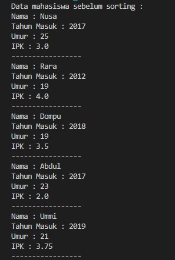

# Laporan Jobsheet IV Algoritma dan Struktur Data

    

Nama : Innama Maesa Putri

NIM : 2341720235

## Percobaan 1

Kode program :

 
 

Hasil program : 

 

Pertanyaan

1. Terdapat di method apakah proses bubble sort?

Jawab : Pada method bubleSort() di class MahasiswaBerprestasi

2. Di dalam method bubbleSort(), terdapat baris program seperti di bawah ini. Untuk apakah proses tersebut?

Jawab : Untuk mengurutkan objek berdasarkan nilai ipk dari terbesar hingga terkecil dengan membandingkan antara objek di suatu index dengan objek di index sebelumnya. Kemudian jika nilai ipk lebih besar akan disimpan di variabel temporal untuk ditukarkan posisinya

3. Perhatikan perulangan di dalam bubbleSort() di bawah ini:

a. Apakah perbedaan antara kegunaan perulangan i dan perulangan j?

Jawab : Perulangan i mengontrol pergerakan dari kiri ke kanan pada array. Perulangan ini akan terus berjalan selama i lebih kecil dari listMhs.length - 1. Ini berarti perulangan akan berhenti ketika i mencapai satu elemen sebelum akhir array. Perulangan j mengontrol perbandingan antar elemen array. Perulangan ini akan terus berjalan selama j lebih kecil dari listMhs.length - i. Ini berarti perulangan akan berhenti ketika j mencapai akhir array pada iterasi saat ini (diatur oleh perulangan i)

b. Mengapa syarat dari perulangan i adalah i < listMhs.length-1 ?

Jawab : Syarat i < listMhs.length - 1 memastikan bahwa perulangan i tidak akan mengakses elemen di luar array. Perulangan perlu berhenti satu elemen sebelum akhir array karena pada tahap terakhir, tidak ada lagi perbandingan yang perlu dilakukan

c. Mengapa syarat dari perulangan j adalah j < listMhs.length-i ?

Jawab : memastikan bahwa perulangan j hanya melakukan perbandingan pada elemen yang belum dibandingkan pada iterasi saat ini. Perulangan perlu berhenti di listMhs.length - i karena elemen di i sudah dibandingkan dengan semua elemen di sebelah kirinya.

d. Jika banyak data di dalam listMhs adalah 50, maka berapakali perulangan i akan berlangsung? Dan ada berapa Tahap bubble sort yang ditempuh?

Jawab : Jumlah perulangan i: 49 (dari 0 sampai 48) Jumlah tahap bubble sort: 49 (sama dengan jumlah perulangan i)

## Percobaan 2

Kode program :

 

Hasil program : 

 

Pertanyaan

Di dalam method selection sort, terdapat baris program seperti di bawah ini. Untuk apakah proses tersebut, jelaskan!

Jawab : Untuk mencari nilai ipk terkecil dari array listMhs dengan membandingkan antar index array

## Percobaan 3

Kode program :

 

Hasil program : 

 

Pertanyaan

Ubahlah fungsi pada InsertionSort sehingga fungsi ini dapat melaksanakan proses sorting dengan cara descending.

 
