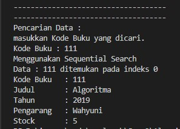

# Laporan Jobsheet VI Algoritma dan Struktur Data

    

Nama : Innama Maesa Putri

NIM : 2341720235

## Percobaan 1

Kode Program : 

 
 

Hasil Program : 

 
 

Pertanyaan 

1. Jelaskan fungsi break yang ada pada method FindSeqSearch!

Jawab : Untuk menghentikan perulangan ketika telah menemukan nilai cari pada kumpulan atribut kode buku di array of object

2. Jika Data Kode Buku yang dimasukkan tidak terurut dari kecil ke besar. Apakah program masih dapat berjalan? Apakah hasil yang dikeluarkan benar? Tunjukkan hasil screenshoot untuk bukti dengan kode Buku yang acak. Jelaskan Mengapa hal tersebut bisa terjadi?

Jawab : Iya, program masih dapat berjalan karena sequential search mencari nilai pada setiap indeks, tidak perlu urut

 

3. Buat method baru dengan nama FindBuku menggunakan konsep sequential search dengan tipe method dari FindBuku adalah BukuNoAbsen. Sehingga Anda bisa memanggil method tersebut pada class BukuMain seperti gambar berikut

 
 

## Percobaan 2

Kode Program : 

 

Hasil Program : 

Pertanyaan

1. Tunjukkan pada kode program yang mana proses divide dijalankan!

Jawab : Ketika program membagi suatu data menjadi dua bagian antara kiri dan kanan yang dipisahkan oleh variable mid

if (right >= left) {
  mid = (left + right) / 2;
}

2. Tunjukkan pada kode program yang mana proses conquer dijalankan!

Jawab : Ketika mulai menemukan hasil dari tiap bagian pada pemanggilan rekursif

if (cari == listBk[mid].kodeBuku) {
  return (mid);
} else if (listBk[mid].kodeBuku > cari) {
  return FindBinarySearch(cari, left, mid);
} else {
  return FindBinarySearch(cari, mid, right);
}

3. Jika data Kode Buku yang dimasukkan tidak urut. Apakah program masih dapat berjalan? Mengapa demikian! Tunjukkan hasil screenshoot untuk bukti dengan kode Buku yang acak. Jelaskan Mengapa hal tersebut bisa terjadi?

Jawab : Program bisa berjalan namun hasil tidak ditemukan, karena metode binary search mencari nilai pada index tengah kemudian dibandingkan dengan nilai yang ingin dicari, jika nilai yang dicari lebih kecil dari pada tengah akan dilakukan pengecekan bagian kiri (jika ascending) namun jika nilai yang dicari lebih besar dari bagian tengah maka akan dilakukan pencarian di bagian kanan.

 

4. Jika Kode Buku yang dimasukkan dari Kode Buku terbesar ke terkecil (missal : 20215, 20214, 20212, 20211, 20210) dan elemen yang dicari adalah 20210. Bagaimana hasil dari binary search?Apakah sesuai? Jika tidak sesuai maka ubahlah kode program binary seach agar hasilnya sesuai!

Jawab : Hasil tidak sesuai dikarenakan data tidak urut, cara mengubahnya adalah mengurutkan data nya terlebih dahulu

 

## Percobaan 3

Kode Program : 

 

Hasil Program : 

 

## Latihan
1. Modifikasi percobaan searching diatas dengan ketentuan berikut ini 
- Ubah tipe data dari kode Buku yang awalnya int menjadi String 
- Tambahkan method untuk pencarian kode Buku (bertipe data String) dengan menggunakan 
sequential search dan binary search.

Kode program : 

 
 
 

Hasil program : 

 
2. Modifikasi percobaan searching diatas dengan ketentuan berikut ini 
- Tambahkan method pencarian judul buku menggunakan sequential search dan binary 
search. Sebelum dilakukan searching dengan binary search data harus dilakukan pengurutan 
dengan menggunakan algoritma Sorting (bebas pilih algoritma sorting apapun)! Sehingga 
ketika input data acak, maka algoritma searching akan tetap berjalan 
- Buat aturan untuk mendeteksi hasil pencarian judul buku yang lebih dari 1 hasil dalam 
bentuk kalimat peringatan! Pastikan algoritma yang diterapkan sesuai dengan kasus yang 
diberikan!

Kode program : 

Hasil program : 

